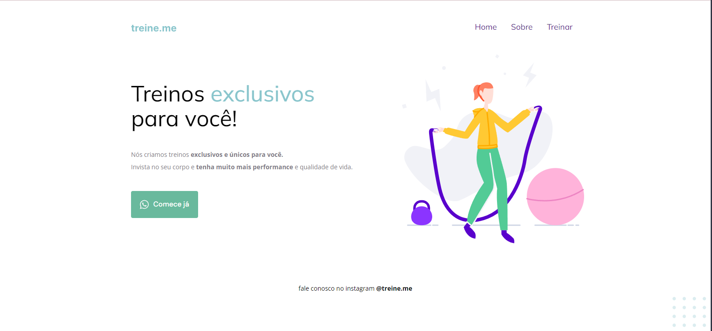

# Web Page Treine.me

This is a learning project to practice html and css basic features and responsivity, using a Figma project as a base for the design.

The page was deployed using Vercel [Access Here](https://treineme-sable.vercel.app/)
